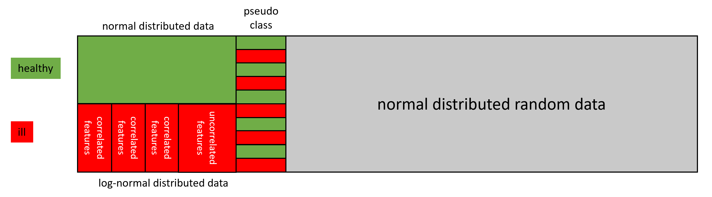

# Data generator for synthetic data including artificial classes, intraclass correlations, pseudo-classes and random data - [Sphinx Doc](https://sigrun-may.github.io/artificial-data-generator/)

## Table of Contents

- [Purpose](#purpose)
- [Data structure](#data-structure)
  - [Different parts of the data set](#different-parts-of-the-data-set)
  - [Data distribution and effect sizes](#data-distribution-and-effect-sizes)
  - [Correlations](#correlations)
- [Pseudo-classes](#pseudo-classes)
- [Random Features](#random-features)
- [Installation](#installation)
- [Licensing](#licensing)

## Purpose

In order to develop new methods or to compare existing methods for feature selection, reference data with known dependencies and importance of the individual features are needed. This data generator can be used to simulate biological data for example artificial high throughput data including artificial biomarkers. Since commonly not all true biomarkers and internal dependencies of high-dimensional biological datasets are known with
certainty, artificial data **enables to know the expected outcome in advance**. In synthetic data, the feature importances and the distribution of each class are known. Irrelevant features can be purely random or belong to a pseudo-class. Such data can be used, for example, to make random effects observable.

## Data structure

### Different parts of the data set

The synthetic-data-generator produces data sets consisting of up to three main parts:

1. **Relevant features** belonging to an artificial class (for example artificial biomarkers)
1. \[optional\] **Pseudo-classes** (for example a patient's height or gender, which have no association with a particular disease)
1. \[optional\] **Random data** representing the features (for example biomarker candidates) that are not associated with any class

The number of artificial classes is not limited. Each class is generated individually and then combined with the others.
In order to simulate artificial biomarkers in total, all individual classes have the same number of features in total.

This is an example of simulated binary biological data including artificial biomarkers:



### Data distribution and effect sizes

For each class, either the **normal distribution or the log normal distribution** can be selected. The different **classes can be shifted** to regulate the effect sizes and to influence the difficulty of data analysis.

The normally distributed data could, for example, represent the range of values of healthy individuals.
In the case of a disease, biological systems are in some way out of balance.
Extreme changes in values as well as outliers can then be observed ([Concordet et al., 2009](https://doi.org/10.1016/j.cca.2009.03.057)).
Therefore, the values of a diseased individual could be simulated with a lognormal distribution.

Example of log-normal and normal distributed classes:


### Correlations

**Intra-class correlation can be generated for each artificial class**. Any number of groups
containing correlated features can be combined with any given number of uncorrelated features.

However, a high correlation within a group does not necessarily lead to
a high correlation to other groups or features of the same class. An example of a class with three
highly correlated groups but without high correlations between all groups:


It is probably likely that biomarkers of healthy individuals usually have a relatively low correlation. On average,
their values are within a usual "normal" range. In this case, one biomarker tends to be in the upper normal range and another biomarker in the lower normal range. However, individually it can also be exactly the opposite, so that the correlation between healthy individuals would be rather low. Therefore, the **values of healthy people
could be simulated without any special artificially generated correlations**.

In the case of a disease, however, a biological system is brought out of balance in a certain way and must react to it.
For example, this reaction can then happen in a coordinated manner involving several biomarkers,
or corresponding cascades (e.g. pathways) can be activated or blocked. This can result in a **rather stronger
correlation of biomarkers in patients suffering from a disease**. To simulate these intra-class correlations,
a class is divided into a given number of groups with high internal correlation
(the respective strength can be defined).

## Pseudo-classes

One option for an element of the generated data set is a pseudo-class. For example, this could be a
patient's height or gender, which are not related to a specific disease.

The generated pseudo-class contains the same number of classes with identical distributions as the artificial biomarkers.
But after the generation of the individual classes, all samples (rows) are randomly shuffled.
Finally, combining the shuffled data with the original, unshuffled class labels, the pseudo-class no longer
has a valid association with any class label. Consequently, no element of the pseudo-class should be
recognized as relevant by a feature selection algorithm.

## Random Features

The artificial biomarkers and, if applicable, the optional pseudo-classes can be combined with any number
of random features. Varying the number of random features can be used, for example, to analyze random effects
that occur in small sample sizes with a very large number of features.

## Installation

The artificial-data-generator is available at [the Python Package Index (PyPI)](https://pypi.org/project/artificial-data-generator/).
It can be installed with pip:

```bash
$ pip install artificial-data-generator
```

## Project Setup

We recommend to do the setup in a text console and not with a GUI tool.
This offers better control and transparency.

We use [Poetry](https://python-poetry.org/docs/) and
[pyenv](https://github.com/pyenv/pyenv). Not Conda, Anaconda or pip directly.

### 1. Get Project Source

First you have to clone the project with GIT.
If you want to make a pull request, you must clone your previously forked project and
not the original project.
After the project has been cloned, use `cd` to change into the project directory.

### 2. Install Poetry

We use [Poetry](https://python-poetry.org/docs/) for dependency management and packaging in this project.
The next step is the [installation of Poetry](https://python-poetry.org/docs/#installation),
if you do not already have it.
Poetry offers different installation options. We recommend the option "with the official installer".
But it does not matter. It's your choice.

### 3. Configure Poetry

We suggest the following two config options. These are not mandatory but useful.

Set [`virtualenvs.prefer-active-python`](https://python-poetry.org/docs/configuration/#virtualenvsprefer-active-python-experimental)
to `true`.
With this setting Poetry uses the currently activated Python version to create a new virtual environment.
If set to false, the Python version used during Poetry installation is used.
This makes it possible to determine the exact Python version for development.
This can be done [global or locale](https://python-poetry.org/docs/configuration/#local-configuration).
We suggest to do this setting as global.

- global setting: `poetry config virtualenvs.prefer-active-python true`
- locale setting: `poetry config virtualenvs.prefer-active-python true --local` - this will create or change the `poetry.toml` file

Set [`virtualenvs.options.always-copy`](https://python-poetry.org/docs/configuration/#virtualenvsoptionsalways-copy)
to `true`.
When the new virtual environment is created (later) all needed files are copied into it instead of symlinked.
The advantage is that you can delete the old globally installed Python version later without breaking the Python in
the locale virtual environment.
The disadvantage is that we waste some disk space.
This can be done [global or locale](https://python-poetry.org/docs/configuration/#local-configuration).
We suggest to do this setting as global.

- global setting: `poetry config virtualenvs.options.always-copy true`
- locale setting: `poetry config virtualenvs.options.always-copy true --local` - this will create or change the `poetry.toml` file

### 4. Set the Python Version (pyenv)

We recommend [pyenv](https://github.com/pyenv/pyenv) to install and manage different Python versions.
First [install pyenv](https://github.com/pyenv/pyenv#installation) if you do not already have it.

Next install the appropriate Python version.
We recommend the development on the oldest still permitted Python version of the project.
This version number can be found in the `pyproject.toml` file in the setting called
`tool.poetry.dependencies.python`. If this is set like `python = "^3.8"`
we use pyenv to install Python 3.8:
`pyenv install 3.8`
This installs the latest 3.8 Python version.

If the Python installation was successful we use `pyenv versions` to see which exact Version is installed.
Then we activate this version with `pyenv local <version>`.
This command will create a `.python-version` file in the project directory.
Make sure that you are still in the project directory.
For example execute: `pyenv local 3.8.17`

### 5. Install the Project with Poetry

Execute `poetry install --all-extras` to install the project.
This installs all dependencies, optional (extra) dependencies and
needed linting, testing and documentation dependencies.
With this method, the sources are also implicitly installed in
[editable mode](https://pip.pypa.io/en/latest/cli/pip_install/#cmdoption-e).

## Licensing

Copyright (c) 2022 Sigrun May, Helmholtz-Zentrum für Infektionsforschung GmbH (HZI)<br/>
Copyright (c) 2022 Sigrun May, Ostfalia Hochschule für angewandte Wissenschaften

Licensed under the **MIT License** (the "License"); you may not use this file except in compliance with the License.
You may obtain a copy of the License by reviewing the file
[LICENSE](https://github.com/sigrun-may/artificial-data-generator/blob/main/LICENSE) in the repository.
